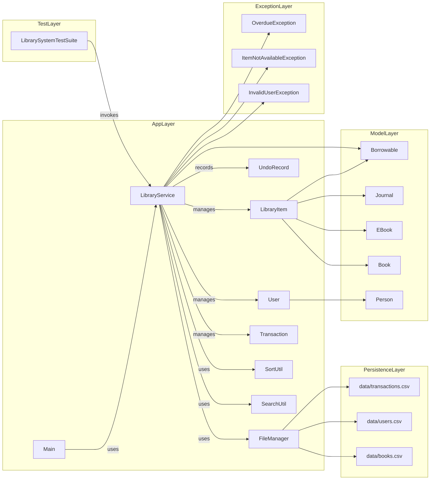

# Smart Library Management System — Complete UML Diagrams

## Overview

This document contains the full UML representation of the current project, including classes, packages, utilities, exceptions, data persistence, and test harness.

## Complete Class Diagram

```mermaid
classDiagram
    package main {
        class Main {
            +main(String[])
            -printMenu()
            -readInteger(Scanner, String)
            -readPositiveInteger(Scanner, String)
            -readNonEmptyString(Scanner, String)
            -addItem(Scanner, LibraryService)
            -addUser(Scanner, LibraryService)
            -searchItem(Scanner, LibraryService)
            -issueItem(Scanner, LibraryService)
            -returnItem(Scanner, LibraryService)
            -reserveItem(Scanner, LibraryService)
        }
    }

    package services {
        class LibraryService {
            -ArrayList~LibraryItem~ items
            -ArrayList~User~ users
            -ArrayList~Transaction~ transactions
            -Stack~UndoRecord~ undoStack
            -String dataFolder
            +LibraryService(String)
            +getItems()
            +getUsers()
            +addItem(String, String, String)
            +addItemWithDetails(String, String, String, String)
            +addUser(String, String)
            +viewItems()
            +searchItemById(String)
            +searchItemsByTitle(String)
            +sortItems()
            +issueItem(String, String, int)
            +returnItem(String, String, int)
            +reserveItem(String, String)
            +saveData()
            +showReports()
            +undoLastTransaction()
        }

        class FileManager {
            +ensureDataFiles(String)
            +loadItems(String)
            +loadUsers(String)
            +loadTransactions(String)
            +saveItems(String, ArrayList~LibraryItem~)
            +saveUsers(String, ArrayList~User~)
            +saveTransactions(String, ArrayList~Transaction~)
        }
    }

    package utils {
        class SearchUtil {
            +searchByID(ArrayList~LibraryItem~, String)
            +searchByTitle(ArrayList~LibraryItem~, String)
        }

        class SortUtil {
            +bubbleSortByTitle(ArrayList~LibraryItem~)
        }
    }

    package models {
        class LibraryItem {
            -String itemID
            -String title
            -String author
            -boolean available
            -Queue~String~ reservationQueue
            -int borrowCount
            +LibraryItem(String, String, String, boolean)
            +calculateFine(int)
            +getType()
            +displayInfo()
            +issueItem(User)
            +returnItem(User)
            +reserveItem(String)
            +peekReservation()
            +pollReservation()
            +removeReservation(String)
            +hasReservation()
            +getReservationList()
            +getItemID()
            +getTitle()
            +isAvailable()
            +getBorrowCount()
            +setAvailable(boolean)
            +toCsv()
            +toString()
        }

        class Book {
            +Book(String, String, String, boolean)
            +calculateFine(int)
            +getType()
            +displayInfo()
        }

        class EBook {
            +EBook(String, String, String, boolean)
            +calculateFine(int)
            +getType()
            +displayInfo()
        }

        class Journal {
            +Journal(String, String, String, boolean)
            +calculateFine(int)
            +getType()
            +displayInfo()
        }

        class Person {
            -String id
            -String name
            +Person(String, String)
            +getId()
            +getName()
            +toString()
        }

        class User {
            -ArrayList~LibraryItem~ borrowedItems
            -String email
            -int maxBorrowLimit
            +User(String, String)
            +User(String, String, String)
            +User(String, String, String, int)
            +borrowItem(LibraryItem)
            +returnBorrowedItem(LibraryItem)
            +getBorrowedItems()
            +canBorrow()
            +getEmail()
            +getMaxBorrowLimit()
            +toCsv()
            +toString()
        }

        class Transaction {
            -String transactionID
            -String userID
            -String itemID
            -int issueDay
            -int dueDay
            -int returnDay
            -double fine
            +Transaction(String, String, String, int, int, int, double)
            +getTransactionID()
            +getUserID()
            +getItemID()
            +getIssueDay()
            +getDueDay()
            +getReturnDay()
            +getFine()
            +setReturnDay(int)
            +setFine(double)
            +isReturned()
            +toCsv()
            +toString()
        }
    }

    package exceptions {
        class InvalidUserException {
            +InvalidUserException(String)
        }

        class ItemNotAvailableException {
            +ItemNotAvailableException(String)
        }

        class OverdueException {
            +OverdueException(String)
        }
    }

    package tests {
        class LibrarySystemTestSuite {
            +main(String[])
        }
    }

    class UndoRecord {
        -String action
        -Transaction transaction
        -String itemId
        -String userId
        -boolean reservationRemoved
        +UndoRecord(String, Transaction, String, String, boolean)
    }

    class Borrowable {
        +issueItem(User)
        +returnItem(User)
    }

    Main --> LibraryService
    LibraryService --> FileManager
    LibraryService --> SearchUtil
    LibraryService --> SortUtil
    LibraryService --> Transaction
    LibraryService --> User
    LibraryService --> LibraryItem
    LibraryService o-- UndoRecord
    UndoRecord --> Transaction
    FileManager --> LibraryItem
    FileManager --> User
    FileManager --> Transaction
    SearchUtil --> LibraryItem
    SortUtil --> LibraryItem
    LibrarySystemTestSuite --> LibraryService
    LibraryItem <|-- Book
    LibraryItem <|-- EBook
    LibraryItem <|-- Journal
    User <|-- Person
    LibraryItem ..|> Borrowable
```

## Component Diagram



## Download Instructions

- To download the diagram file from VS Code:
  1. Open `UML_Diagrams.md` in the editor.
  2. Right-click the tab and choose **Reveal in Explorer** or use the Explorer view.
  3. Copy or move the file to a folder you want, or use your file manager to download it from the workspace path.

- To export the diagram as an image:
  1. Install a Mermaid preview extension in VS Code, such as **Markdown Preview Mermaid Support**.
  2. Open `UML_Diagrams.md` and use the Mermaid preview panel.
  3. Export as PNG/SVG from the preview panel or copy the Mermaid code into https://mermaid.live/ and use **Export**.

- If you want a standalone image file, I can also generate a `.svg` or `.png` file for you next.
