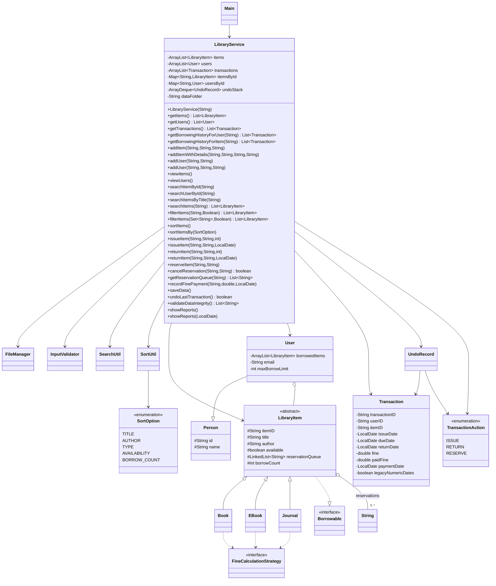
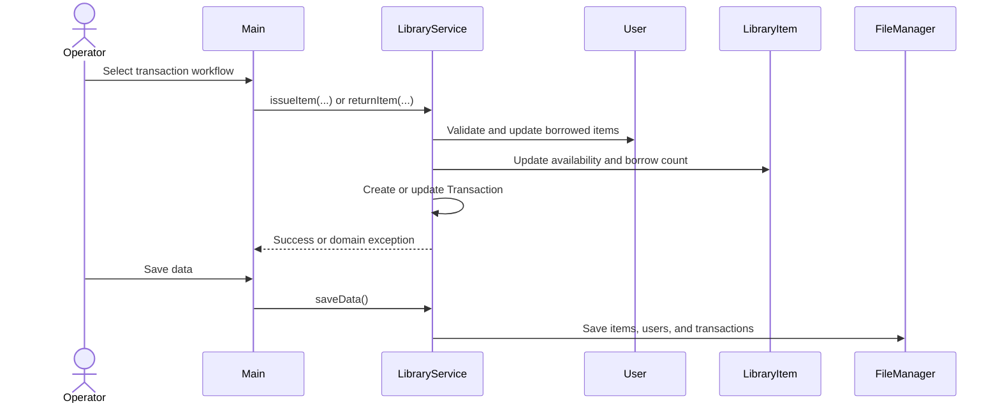

# UML diagrams

The diagrams describe the current Java source structure and public service/model APIs.

## Class diagram

## Issue and return flow

## State notes

Transactions are persisted. Reservations are session-only. Legacy numeric transaction rows are converted to dates internally, while ISO date rows are supported directly. `HashMap` indexes items and users by normalized ID, and `ArrayDeque` stores undo records.